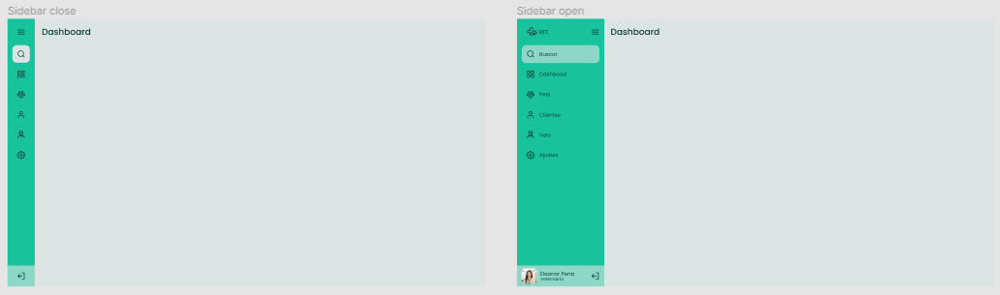
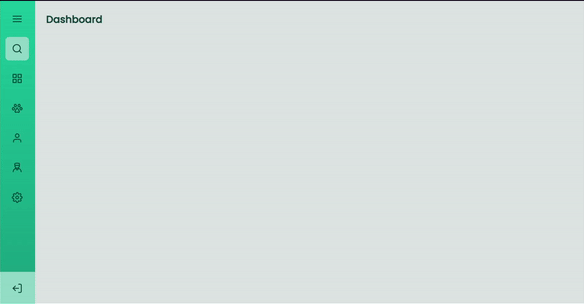

# Sidebar

## 🎯 Desafio:

Neste desafio, foi proposto a criação de uma sidebar que alterne entre 'aberta' e 'fechada'.
 
### Layout disponibilizado:

 

## 🚀 Resultado: 

<a href="https://sidebar-gold.vercel.app">Clique aqui para acessar o projeto</a> 

## ⚒️ Tecnologias utilizadas:
* JavaScript
* HTML
* CSS
